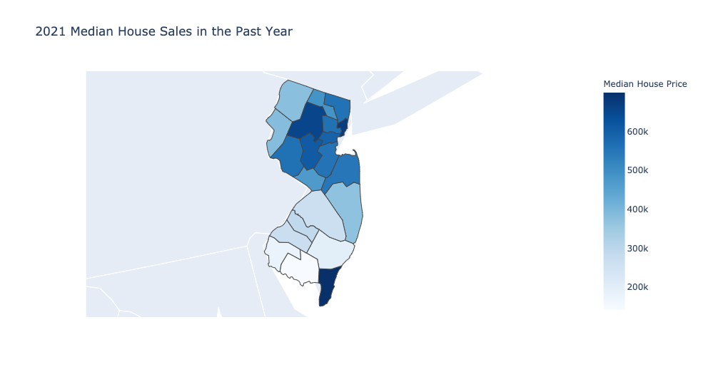
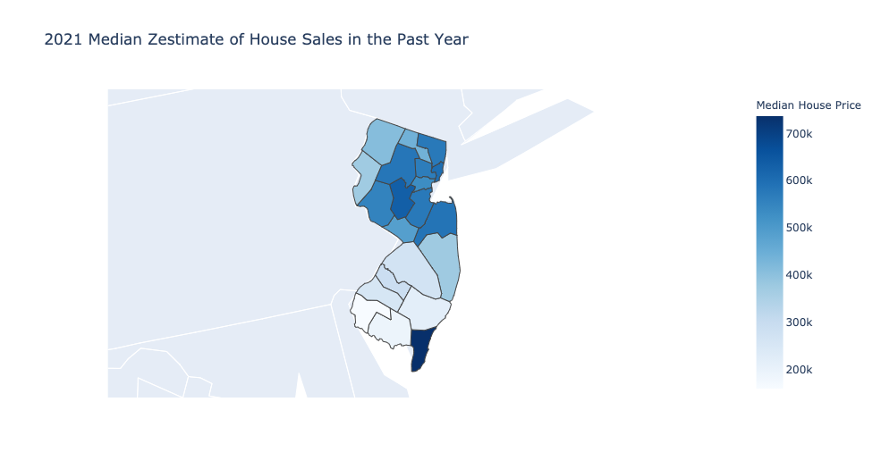

# 2021_njHousing_analysis
This uses a small dataset (dataset.json) of housing data to create the maps.  The .csv file is a table of Zip Codes to FIPS County Codes,
this will be removed from the repo after creation of a python package that has a mapping function built-in. All you need is Andaconda and Jupyter Notebook to run
the notebook. The following plots were produced by the Notebook

  

      
    </a>
  

  

      
    </a>
  

